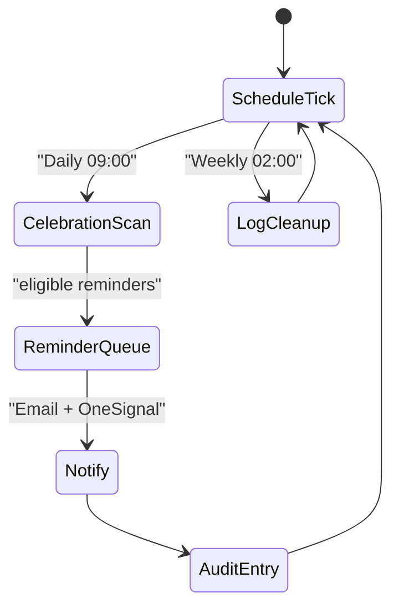
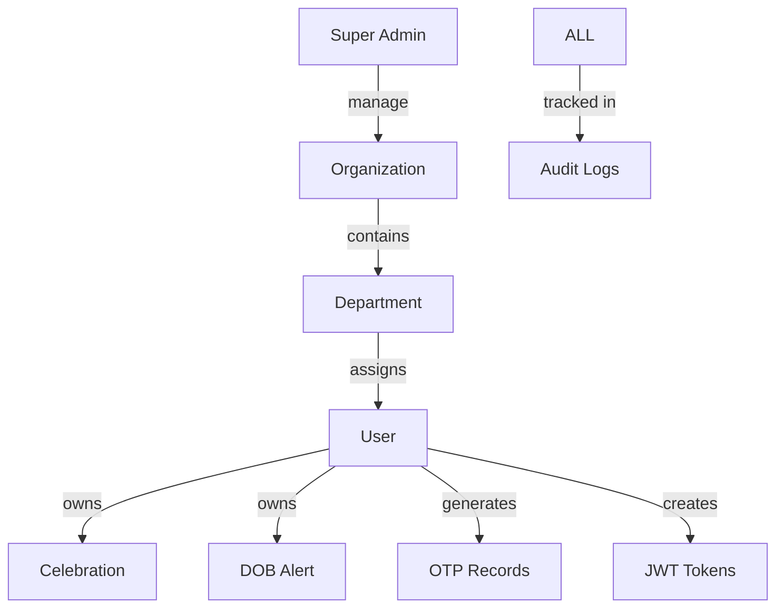
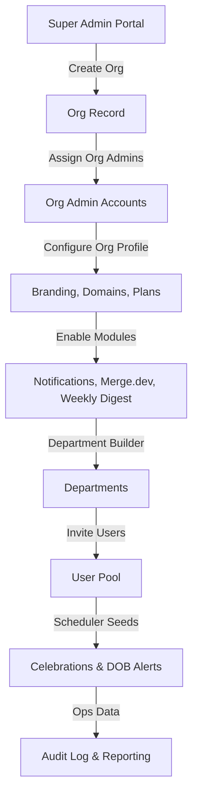
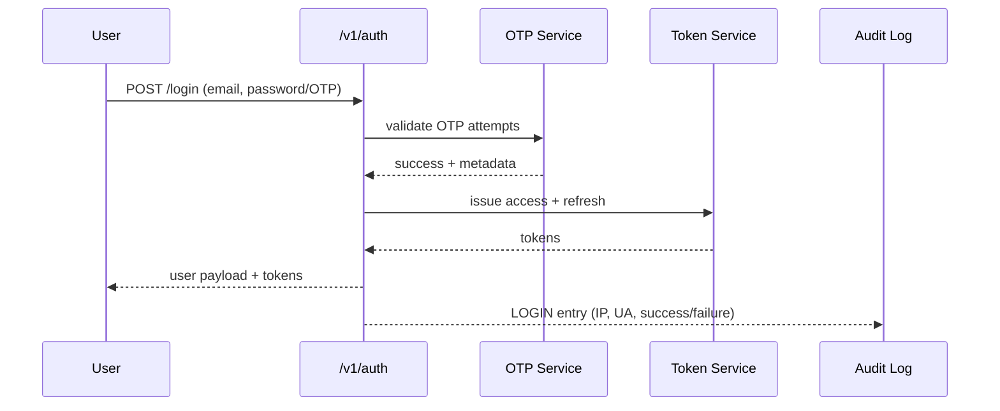
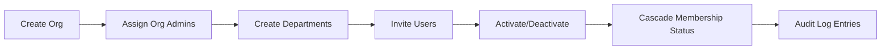
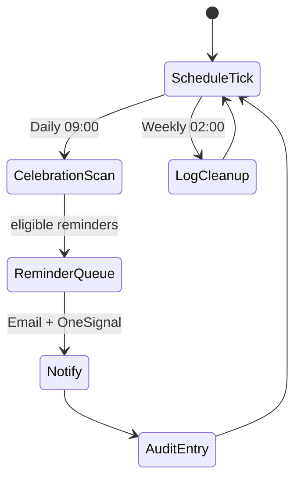

# Bridge Bond Platform Overview

This document distills how Bridge Bond’s backend works end-to-end: what we have built, how the system fits together, and how we validate everything. It complements the API- and feature-specific guides by focusing on functionality, flows, and quality practices (not code-level details).

---

## 1. Executive Snapshot

- **Product Goal**: Multi-tenant enterprise management platform delivering hierarchical RBAC, advanced org/user management, automated celebrations & DOB reminders, HR engagement tooling, and deep audit trails.
- **Stack**: Node.js + Express REST API, MongoDB via Mongoose, Passport JWT auth, OneSignal/email notifications, PM2/Docker deployment.
- **Security Posture**: OTP-first login/reset, JWT short-lived access tokens, audit logging for every action, soft-delete for recoverability, strict role permissions.
- **Automation Highlights**: Cron-based scheduler for celebrations/DOB alerts/log cleanup, OneSignal notification fan-out, daily reminders, automated seeding with realistic data.
- **Documentation Surface**: 70+ markdown guides + Swagger UI at `/v1/docs` covering auth, deployments, integrations, and testing.

---

## 2. System Architecture (High-Level)

**Key Traits**
- Stateless API nodes behind load balancer (PM2, Docker) with centralized MongoDB.
- All entry traffic flows through shared middlewares (auth, validation, audit logging).
- Services encapsulate business logic; controllers remain thin orchestrators.
- Scheduler bootstraps on app start to run timed jobs independent of request cycle.

---

## 3. Domain & Data Model

- **Multi-tenancy**: Organizations isolate data; users can belong to multiple orgs/departments with scoped permissions.
- **Soft Delete** across users, orgs, departments, celebrations, and DOB alerts for safe recovery.
- **Audit Log** is a first-class model capturing every API event, resource mutation, and scheduler action.

---

## 4. Role & Permission Matrix

| Role | Operational Scope | Key Permissions (subset) | Primary Interfaces |
| --- | --- | --- | --- |
| **Super Admin** | Global control across all tenants | `manageOrganizations`, `manageUsers`, `getPlans`, `viewAuditLogs`, `manageQuestions`, `manageDepartments`, `manageOrgUsers` | Super admin dashboard, platform settings, audit log console |
| **Organization Admin** | Single organization they belong to | Inherits user perms + `updateOrganization`, `manageDepartments`, `manageOrgUsers`, `manageQuestions` | Org admin portal, department builder, user roster |
| **User** | Their memberships inside assigned orgs/departments | `getProfile`, `updateProfile`, `getOrganization`, `getDepartments`, `getQuestions`, `answerQuestions`, `reactToAnswers`, `manageOwnSettings` | Employee portal, celebrations feed, questions module |

**Permission Sources & Enforcement**
- Rights defined centrally in `src/config/roles.js`; exported via `roleRights` map.
- `auth(requiredRights)` middleware checks JWT, derives user rights, and ensures scope alignment.
- Services apply tenant filters to guarantee org-level isolation even when a token is valid.
- Audit logs capture authorization successes/failures for compliance evidence.

### Role Journeys
- **Super Admin**
  - Bootstrapped via `npm run create-superadmin` or migration scripts.
  - Manages tenant onboarding, licensing/plans, notification providers, and system settings.
  - Has system-wide audit visibility (`/v1/audit-logs/**`) and can trigger manual scheduler actions.
- **Organization Admin**
  - Created by super admin or promoted from user pool; automatically inherits all user-level permissions.
  - Owns org profile, department topology, user roster, celebration templates, localized audit access, and question distribution.
  - Scoped queries ensure they only impact their org even if they attempt cross-tenant IDs.
- **User**
  - Added through invites, seeding, or HR integrations.
  - Completes OTP-based onboarding, manages own profile/settings, interacts with questions/celebrations modules, and receives scheduler-driven notifications.
  - Limited to viewing org/departments they belong to; cannot see other tenants.

---

## 5. Platform Modules (Full Catalog)

| Module | Code Surface | Responsibilities | Super Admin | Org Admin | User |
| --- | --- | --- | --- | --- | --- |
| **Authentication & OTP** | `controllers/auth.*`, `services/auth.*`, `middlewares/auth.js`, `validations/auth.*`, `models/token.js`, `models/otp.js` | OTP issuance/verification, JWT issue/refresh, password reset, email verification, rate limiting, last-login tracking | Configure policies, revoke tokens, monitor audit logs | Trigger org resets, monitor access | Login, verify, reset password |
| **User Management** | `controllers/user.*`, `services/user.*`, `models/user.js`, `validations/user.*` | CRUD, role assignment, soft delete/restore, membership management, preference storage | Manage all users cross-tenant | Manage org users | Manage own profile |
| **Organization Management** | `controllers/organization.*`, `services/organization.*`, `models/organization.js` | Tenant lifecycle, domain validation, cascading activation/deactivation, logos/settings | Create/update/delete tenants, manage plans | Update org profile/status | View-only |
| **Department Management** | `controllers/department.*`, `services/department.*`, `models/department.js` | Department CRUD, membership assignment, cascades | Full control | Org-scoped control | View assigned |
| **Celebrations** | `controllers/celebration.*`, `services/celebration.*`, `models/celebration.js` | Event setup, reminder config, recurring scheduling, participant tracking | Global templates/analytics | Configure org celebrations | Receive/react |
| **DOB Alerts** | `controllers/dobAlert.*`, `services/dobAlert.*`, `models/dobAlert.js` | Personal reminder flows, alert cadence, associations | Define defaults | Manage org alerts | Receive alerts |
| **Questions & Reactions** | `controllers/masterQuestions.*`, `controllers/questions.*`, `services/question.*`, `models/question.*` | Master question libraries, org distributions, answer capture, reactions | Create master bank | Deploy/manage org questions | Answer/react |
| **Audit & Compliance** | `middlewares/auditLog.js`, `models/auditLog.js`, `controllers/auditLog.*`, `services/auditLog.*` | Request logging, diff storage, stats, retention cleanup | Full visibility + cleanup | Scoped analytics | N/A |
| **Scheduler Automation** | `services/scheduler.service.js`, cron bootstrap in `src/index.js`, `docs/development/SCHEDULER_GUIDE.md` | Cron jobs for celebrations, DOB alerts, birthdays, audit cleanup, manual triggers | Configure cadence & retention | Monitor success, trigger manual runs | Consumers |
| **Notification Delivery** | `services/notification.*`, `services/email.service.js`, `integrations/onesignal/*`, `docs/setup/NOTIFICATION_SETUP.md` | OneSignal push, SMTP email, templating, retries, provider health logging | Configure providers | Segment recipients | Receive |
| **Uploads & Media** | `middlewares/upload.js`, `services/upload.*`, `docs/guides/IMAGE_UPLOAD_SYSTEM.md` | File validation, Cloudinary/S3 integration, signed URLs, transformations | Provider setup | Upload org assets | Upload avatars/files |
| **Reporting & Dashboards** | `controllers/dashboard.*`, `services/reporting.*`, audit stats endpoints | System/org KPIs, usage breakdowns, notification success metrics | Global KPIs | Org KPIs | Personal history |
| **Integrations** | `src/integrations/*`, `docs/development/INTEGRATION_*`, `docs/guides/UPDATE_TO_BRIDGEBOND_AI.md` | HRIS sync (Merge.dev), webhook handlers, credential storage, third-party SDKs | Enable connectors, manage creds | Consume connectors | Benefit from synced data |
| **Testing & QA** | `tests/*`, `postman-collection.json`, `docs/api/API_TESTING_GUIDE.md`, `docs/testing` | Jest unit/integration suites, Postman/Newman packs, fixtures, coverage | Enforce CI | Trigger org regression packs | N/A |

---

## 6. Feature Deep Dives

### 6.1 Organization & Multi-Tenant Management
- **Org Topology**: Super admins create org shells, configure domains, upload branding, and assign at least two org admins. Each org contains 10+ seed departments with optional custom ones.
- **Org Admin Controls**: Manage departments, invite/promote users, configure celebrations/questions, handle notification segments, and review localized audit logs.
- **Multi-Org Users**: A single user document can hold memberships for multiple organizations and departments; permissions resolve per-request based on current org context.
- **Cascading State**: Deactivating an org or department cascades to user memberships, ensuring no orphaned active access.

### 6.2 Roles, Permissions, Plans, and Subscription Layers
- **Roles**: `superadmin`, `org_admin`, `user` defined in `roles.js`; permissions such as `manageOrganizations`, `manageUsers`, `managePlans`, `manageQuestions`, etc.
- **Permission Enforcement**: `auth(requiredRights)` middleware plus service-level tenant filters; audit log captures enforcement outcomes.
- **Subscription & Plans**: `managePlans` and `getPlans` rights restricted to super admins; plans define limits for org size, departments, automation features (weekly digest, notifications).
- **Org-Level Feature Toggles**: Plans can enable/disable modules like weekly digest, Merge.dev sync, or advanced notification templating.

### 6.3 Notification System
- **Channels**: Email (SMTP) and push (OneSignal). All notifications originate from services in `services/notification.*`.
- **Event Sources**: Celebrations reminders, DOB alerts, weekly digests, OTP emails, manual broadcasts.
- **Scheduling**: Cron jobs queue notifications daily at 09:00; audit log tracks each send, success/failure, and retries.
- **Org Controls**: Org admins can enable/disable certain channels per feature (e.g., only email for DOB alerts).

### 6.4 Merge.dev Integration (HRIS Sync)
- **Documentation**: `docs/development/MERGE_DEV_*`, `INTEGRATION_ARCHITECTURE.md`, `MERGE_DEV_SETUP_GUIDE.md`.
- **Purpose**: Import HRIS employee/org structures, map them to Bridge Bond tenants, keep people data synchronized.
- **Super Admin Responsibilities**
  - Configure global Merge.dev account credentials (API key, webhook secret) via secure environment variables.
  - Define mapping templates (fields → Bridge Bond models) and enable connector types (HRIS, ATS, Payroll).
  - Monitor integration health dashboards; audit logs capture each sync request/response.
- **Org Admin Self-Service Flow**
  1. Org admin navigates to the Integrations tab and selects “Connect HRIS (Merge.dev)”.
  2. Bridge Bond requests a Merge `link_token` from our backend using the super admin’s configured credentials.
  3. Org admin is redirected to Merge’s Hosted Link experience to pick their HRIS vendor and authenticate.
  4. Merge returns a `linked_account_token` scoped to that org; backend stores it encrypted against the org record.
  5. Scheduler kicks off an initial sync: departments → users → employment metadata. Audit logs record each resource import.
  6. Subsequent delta syncs run hourly/daily (configurable) via Merge’s sync status endpoints and webhooks.
- **User Experience**
  - End users do not interact with Merge directly; they just see up-to-date org rosters, departments, celebrations seeded from HRIS data.
  - Users imported via Merge receive invitation emails/OTP credentials automatically if they don’t already exist.
- **Security & Privacy**
  - Linked account tokens are scoped per organization; revoking an org integration doesn’t impact others.
  - Webhook payloads validated via signature headers; failures logged in audit tables with retry support.

### 6.5 Weekly Digest & Engagement Features
- **Weekly Digest**: Summaries of celebrations, DOB alerts, answered questions, and org announcements emailed every week. Controlled via scheduler and stored preferences per user.
- **Feature Guides**: `docs/development/WEEKLY_DIGEST_AND_USER_SETTINGS_FEATURE.md` and `FEATURE_GUIDES.md` explain toggles, templates, and preference flows.
- **User Preferences**: `manageOwnSettings` permission lets users opt into/out of digests, push notifications, and question reminders.

### 6.6 Super Admin vs Org Admin vs User Actions (Quick Reference)

| Workflow | Super Admin | Org Admin | User |
| --- | --- | --- | --- |
| Organization onboarding | Create, configure, assign admins, set plan | Complete org profile, invite users | N/A |
| User lifecycle | Create across any org, change roles, hard delete | Create within org, soft delete, restore | Update own profile, deactivate self (soft) |
| Multi-org membership | View/manage all | Manage only for their org | Join multiple orgs via invites |
| Notification policies | Define defaults, providers, failover | Configure org templates, enable/disable modules | Opt-in/out via preferences |
| Merge.dev sync | Configure credentials, mapping rules | Monitor imported records | Consumes synced data |
| Weekly digest | Enable per plan, set cadence | Customize org sections, target groups | Receive digest, adjust settings |
| Audit log access | System-wide views & cleanup | Org-scoped queries (if permitted) | View own history via profile exports |

### 6.7 Organization Management Flow (Detailed)

- **Create Org**: Super admin provides org name, domains, plan tier, and optional seed data. Org starts in `pending` status until at least one admin is assigned.
- **Assign Org Admins**: Super admin promotes existing users or creates new org admins; invites are sent via OTP email.
- **Org Configuration**: Org admin sets logos, themes, timezone, notification defaults, and merges additional departments.
- **Module Enablement**: Based on plan, org admins toggle Merge.dev integration, weekly digest, celebrations, etc. System validates entitlement before activation.
- **User Onboarding**: Org admins invite or import users; for Merge-connected orgs, HRIS sync auto-creates members and binds them to departments.
- **Ongoing Operations**: Org admins monitor audit logs scoped to their org, adjust departments, manage notifications, and rely on scheduler automation.

---

## 7. Functional Flows

### 7.1 Authentication + OTP Journey

**Controls**
- 4-digit OTP codes stored with expiry + attempt counters.
- Rate limiting at route + OTP level to prevent brute force.
- `lastLoginAt` updated on success; tokens persisted for refresh.

### 7.2 Organization Lifecycle

- Superadmin-only creation; domain + metadata stored.
- Cascading deactivation ensures departments/users inherit the org state.
- Audit logs capture every CRUD + soft delete/restore event.

### 7.3 Automation & Notification Loop

- Uses `node-cron`; manual trigger endpoints exist for admins.
- All notifications funnel through OneSignal/email services for omnichannel delivery.
- Log cleanup enforces 90-day retention by default.

---

## 8. Functional Requirements

- **Tenant & Organization Management**
  - Super admins can create, configure, and retire any organization.
  - Each organization must support branded assets, timezone, domain control, and plan assignment.
  - Org admins can manage departments, import data, and enable/disable optional modules (celebrations, weekly digest, Merge.dev).
- **User & Membership Lifecycle**
  - Users can belong to multiple organizations and departments with independent status per membership.
  - Org admins can invite, soft delete, restore, and reassign users; super admins can hard delete globally.
  - Every membership change cascades to dependent modules (notifications, celebrations, digests).
- **Authentication & Security**
  - OTP-based login, password reset, and email verification with configurable expiration and attempt tracking.
  - JWT access + refresh tokens issued on successful login; refresh rotates both tokens.
  - Role-based authorisation enforced per route with audit entries for every permit/deny decision.
- **Engagement Modules**
  - Celebrations and DOB alerts allow recurring reminders, participant management, and automated scheduling.
  - Question & reaction system distributes master templates to orgs and captures employee engagement.
  - Weekly digest consolidates events, celebrations, and announcements per user preference.
- **Notifications**
  - Email and push channels, with org-level toggles per module.
  - Scheduler queues reminders at configured times; retriable sending with observable status.
- **Integrations (Merge.dev HRIS)**
  - Super admin configures Merge account once; each org can link its own HRIS via Hosted Link.
  - Initial sync must import org units, departments, users, and employment metadata; delta syncs follow schedule or webhook triggers.
  - Org admins can pause/resume sync without affecting other tenants.
- **Audit & Compliance**
  - Every request, scheduler job, integration event, and data mutation is logged.
  - Org admins can query logs filtered to their tenant; super admins see global stats and can initiate retention cleanup.
- **Reporting & Dashboards**
  - Provide KPIs on usage, notification success, integration status, and audit stats per role scope.
  - Export capabilities for compliance (user lists, audit trails, notification history).

---

## 9. Non-Functional Requirements

- **Availability & Scalability**: Stateless API nodes can be horizontally scaled; MongoDB clustering ensures data durability. Scheduler must recover gracefully across restarts.
- **Performance**: Common operations (login, user lookup, notifications) should respond within sub-second latency under nominal load; background jobs handle heavy lifting to keep APIs responsive.
- **Security & Privacy**: OTP secrets, Merge tokens, and SMTP credentials stored securely; PII encrypted at rest where applicable; audit log redacts sensitive values.
- **Observability**: Centralised logging (Winston/Morgan), audit analytics, and integration health checks provide visibility into every workflow.
- **Reliability & Resilience**: Soft delete prevents accidental data loss; cron jobs include retry logic; Merge webhook failures are reprocessed automatically.
- **Compliance & Retention**: Audit data retained for configurable periods (default 90 days) with scheduled cleanup; exports support legal requests.
- **Extensibility**: Module boundaries (auth, orgs, notifications, integrations) support adding new connectors or engagement flows without touching core RBAC.

---

## 10. Operational Journey (End-to-End)

1. **Super Admin Setup**
   - Creates new organization, assigns plan, configures branding/domains, and nominates org admins.
   - Enables desired modules (notifications, Merge.dev, weekly digest) per tenant.
2. **Org Admin Enablement**
   - Completes organization profile, builds departments, invites or imports users, and sets notification preferences.
   - Optionally launches Merge.dev Hosted Link to connect their HRIS; initial sync populates roster.
3. **User Onboarding**
   - Receives OTP invitation, sets password, and gains access scoped to assigned orgs/departments.
   - Updates personal settings (notification preferences, digest opt-ins).
4. **Day-to-Day Operations**
   - Users answer questions, react to celebrations, and receive DOB/celebration reminders.
   - Org admins monitor activity dashboards, adjust departments, approve integrations, and manage notifications.
   - Scheduler runs daily jobs, dispatches reminders, processes Merge syncs, and prunes audit logs.
5. **Governance & Reporting**
   - Super admins review system-wide audit stats, license usage, integration health, and notification KPIs.
   - Org admins export audit trails, user rosters, and digest summaries as needed for compliance or leadership updates.

---

## 11. Document Navigation

- **Section 1–3**: High-level positioning, architecture, and data relationships.
- **Section 4–5**: Role responsibilities and module catalog.
- **Section 6**: Feature deep dives (org management, permissions, notifications, Merge.dev, digest).
- **Section 7**: Primary functional flows (auth, org lifecycle, automation).
- **Section 8–9**: Formal functional/non-functional requirement sets.
- **Section 10**: Operational journey tying everything together.

Use this ordering when presenting to stakeholders: executive snapshot → domain model → role/multi-org story → feature and integration deep dives → requirements → operational journey.
