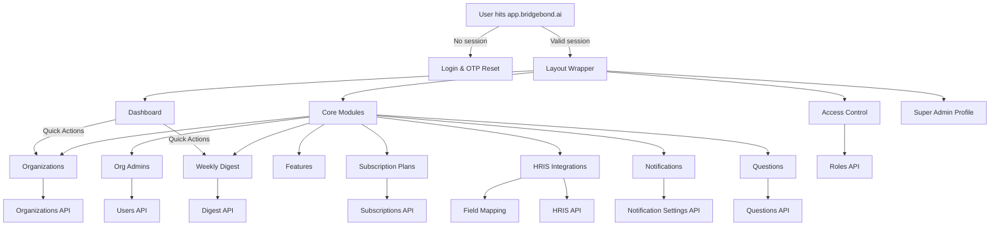

# Bridgebond Super Admin – System Overview

_Last updated: Nov 21, 2025_

## 1. End-to-End Flow

## 2. Major Functional Blocks

| Area | Key Capabilities | Notes |
|------|------------------|-------|
| Authentication & Session | Login, logout, refresh tokens, OTP reset, OneSignal bootstrap | Guards all protected routes; stores tokens/IDs in `localStorage`. |
| Dashboard | KPI cards, DAU chart, monthly signup, activity feed, quick actions | Powered by `useSuperadminDashboard`; expects aggregated backend payload. |
| Organization Ops | CRUD, suspend/activate, admin visibility, search filters | URL params synced for deep links; modals for add/edit/delete. |
| Organization Admins | Multi-filter table, assign to multiple orgs, detail view, delete | Uses `useUsers` with `role=org_admin`, debounced search, assign modal. |
| Subscription Plans | Metrics by tier, filters for plan/billing/status, edit & toggle | Pulls `useSubscriptions`, `usePlans`, `useSubscriptionStats`. |
| Feature Management | Feature cards + access matrix | Data-driven UI keyed by feature `key`. |
| HRIS Integrations | Status board, connect/disconnect, sync trigger, link to mapping | Integrations `GET` + `PATCH` endpoints; drop-in candidate for Merge.dev connectors. |
| Field Mapping | Map Bridgebond canonical fields to HRIS fields per integration | Uses dropdown control + save/discard; expects `currentMappings` + `standardFields`. |
| Weekly Digest | Enable/disable, schedule, open rate, last sent, edit modal | React Query invalidations ensure UI stays in sync after toggles. |
| Notification Settings | Org-wide matrix for celebrations, profile updates, engagement alerts | Supports “days before” dropdown and boolean toggles per feature. |
| Manage Questions | Separate tabs for basic vs manual libraries, add/edit/delete | Hooks ready for backend CRUD endpoints. |
| Access Control | Role catalog, permission matrix, create/edit/delete, assign user roles | `useRoles`, `permissionsObjectToArray`, `buildPermissionIndex`. |
| Super Admin Profile | View/update personal details, avatar upload (FormData) | Distinguishes JSON vs multipart payload automatically. |

## 3. Roles & Permissions

| Role | Description | Typical Permissions |
|------|-------------|---------------------|
| `superadmin` | Bridgebond HQ staff | Full CRUD across modules, role management, integrations, notifications, subscriptions. |
| `org_admin` | Customer admin covering one or more organizations | Organization + membership management, limited feature toggles per org (depends on backend config). |
| `user` | Standard org user | Read-only or action-specific permissions such as answering questions, viewing digests (backend-defined). |
| Custom roles | Defined via Access Control UI | Permissions assigned via boolean flags synced with backend role definitions. |

Helper hook `useUserPermissions` merges profile role + roles payload, exposing `hasPermission`, `hasAny`, `hasAll` to gate UI elements.

## 4. Integrations & External Services

- **OneSignal Web Push:** Bootstrapped once per session with customizable categories & welcome messaging to handle browser notifications.
- **HRIS Connectors:** UI and API layer support multiple HRIS providers (e.g., BambooHR, ADP, Paycom, Workday, Paychex, Rippling, UKG). The architecture also allows adoption of an aggregation platform such as Merge.dev should the backend choose to abstract provider-specific logic.

## 5. Data & API Dependencies

| Module | Required API | Payload Highlights |
|--------|--------------|--------------------|
| Dashboard | `/superadmin/dashboard` | `stats`, `recentActivity`, daily series data. |
| Organizations | `/organizations` | Paging metadata, admin references, plan info. |
| Org Admins | `/users?role=org_admin` | `organizationMemberships`, verification flags. |
| Subscription Plans | `/subscriptions`, `/plans`, `/subscriptions/stats` | Plan metadata, statuses, billing cycle, limit/paging. |
| Features | `/features` | `key`, `name`, `description`, optional category. |
| HRIS Integrations | `/hris/integrations`, `/hris/integrations/:id` | Platform, status, employee counts, field mappings, standard fields. |
| Weekly Digest | `/digests` | Enabled flag, schedule, stats, last sent. |
| Notifications | `/notifications/settings` | Per-org celebration/profile/engagement settings. |
| Questions | `/questions/basic`, `/questions/manual` | Libraries with CRUD support. |
| Roles & Permissions | `/roles`, `/roles/permissions`, `/roles/users/:id` | Boolean permission maps, metadata flags `isEditable`, `isSystemDefault`. |
| Profile | `/profile` | Personal info + avatar upload endpoint. |

## 6. QA & Deployment Flow

1. **Local** – `yarn dev`, mock/stub backend responses as needed.
2. **Staging** – `yarn build:staging`, deploy via PM2 using `ecosystem.config.cjs`; run integration QA once backend endpoints aligned.
3. **Production** – `yarn build:production`, PM2-managed process, OneSignal production app ID.
4. **Monitoring** – PM2 logs under `/logs`, OneSignal dashboard for web push metrics.

---

For deeper architectural or API details, refer to `README.md`, `docs/ENVIRONMENT_SETUP.md`, and `src/api/README.md`. Let the team know if more diagrams or module deep dives are required.

