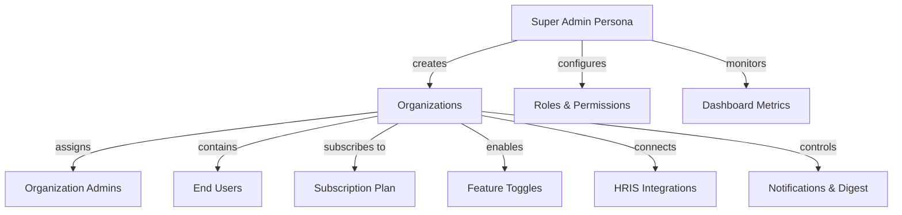
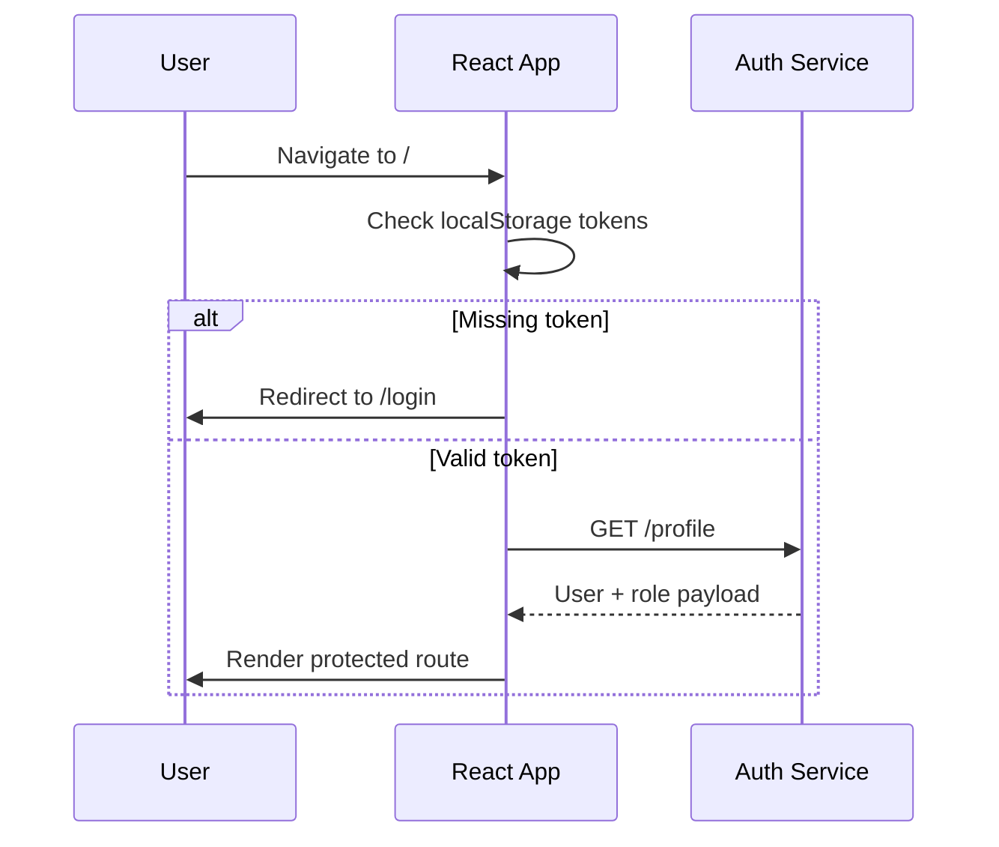
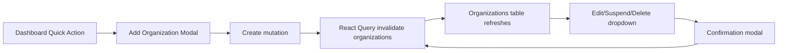
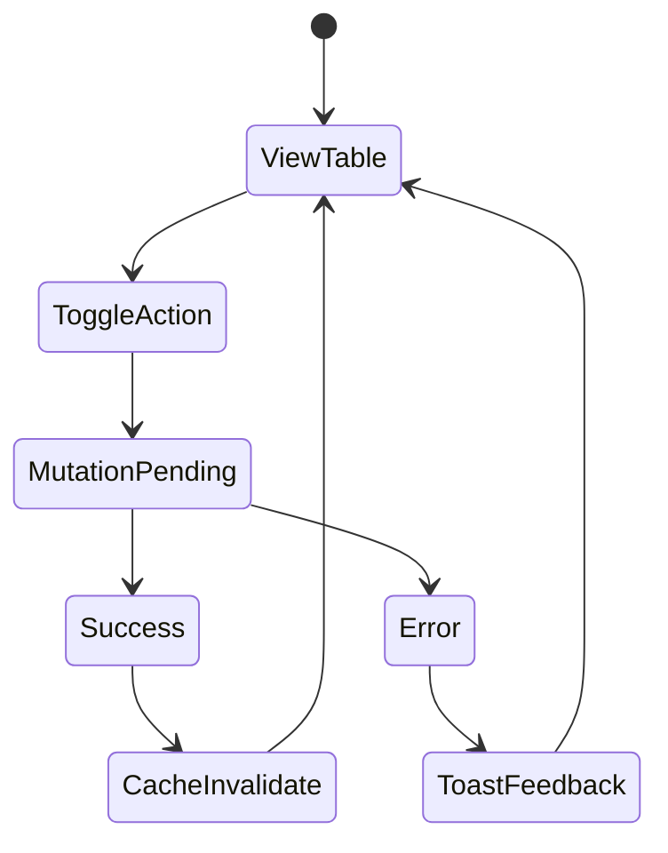

# Bridgebond Super Admin – Platform Overview


## 1. Executive Snapshot

- **Product Goal**  
  Provide Bridgebond HQ with a multi-tenant control plane to create and manage organizations, administrators, subscriptions, integrations, notifications, and engagement settings from a unified React experience.

- **Stack Highlights**  
  React 19 + Vite SPA, React Router protected routes, React Query data management, Ant Design component library, Tailwind-style utility classes, React Hook Form + Zod validation, OneSignal browser push integration, and a token-aware API client with automatic refresh queueing.

- **Security Posture**  
  OTP-enabled login/reset, guarded routes, permission-aware rendering (`useUserPermissions`), auto-logout fallback when refresh fails, and local persistence of access/refresh tokens scoped per session.

- **Automation Hooks**  
  UI surfaces scheduling, notification toggles, HRIS sync readiness, and feature gating; backend automation (digests, notifications, HRIS sync) is configured through these controls and represented via status chips, charts, and audit tables.

- **Documentation Surface**  
  README, environment/setup guides, API hook reference, and this platform overview to brief stakeholders or onboarding team members.

---

## 2. System Architecture (High-Level)

```mermaid
graph TD
  subgraph Client
    U[Super Admin Browser Session]
  end

  U -->|React Router| LW[Layout Wrapper]
  LW -->|ProtectedRoute| PG[Page Components]
  PG --> RQ[React Query Hooks]
  RQ --> API[API Client (fetch + refresh queue)]
  API -->|HTTPS| BE[Bridgebond REST API]

  LW --> NAV[Sidebar & Navbar]
  LW --> SIG[OneSignal Init Guard]

  subgraph Modules
    PG --> M1[Dashboard]
    PG --> M2[Organizations]
    PG --> M3[Org Admins]
    PG --> M4[Subscription Plans]
    PG --> M5[Features Mgmt]
    PG --> M6[HRIS Integrations]
    PG --> M7[Field Mapping]
    PG --> M8[Weekly Digest]
    PG --> M9[Notification Settings]
    PG --> M10[Manage Questions]
    PG --> M11[Access Control]
    PG --> M12[Super Admin Profile]
  end
```

**Key Traits**

- Layout wrapper persists navigation chrome and toggles sidebar collapse state in `localStorage`.
- React Query centralizes server state with caching, refetching, and optimistic updates.
- API client handles JSON/FormData payloads, token refresh, retry queue, and forced logout coverage.
- OneSignal initializes once per session to register push tags and prompts.

---

## 3. Experience & Domain Model



- **Multi-Tenant Visibility**: Tables, filters, and KPIs show org status, plan tier, admin contacts, and adoption metrics system-wide.
- **Role-Based Rendering**: Components such as `ProtectedComponent` and the permissions hook ensure only entitled users see specific actions.
- **State Alignment**: UI fields map directly to backend payloads (organizations, users, plans, integrations), minimizing translation gaps.

---

## 4. Personas & Role Journeys

| Persona | Journey Highlights | UI Touchpoints |
| --- | --- | --- |
| **Super Admin (primary user of this app)** | Authenticates via OTP, lands on dashboard, navigates through sidebar, manages all modules, updates own profile, accepts push notifications. | Dashboard, Organizations, Org Admins, Plans, Feature Mgmt, HRIS, Field Mapping, Notifications, Weekly Digest, Questions, Access Control, Profile. |
| **Organization Admin (managed entity)** | Created/edited within Org Admin module; assigned to one or multiple orgs; can be suspended or deleted. | Org Admins table, Assign Organizations modal, detail drawer, delete modal. |
| **Org User (reference)** | Represented in metrics, plan usage, and integration counts; receives notifications configured by admins. | Dashboard stats, plan quotas, digest/notification modules indicating user impact. |

Journeys are data-driven: when backend roles change permissions, UI automatically reflects new capabilities without code changes.

---

## 5. Functional Module Catalog

| Module | Responsibilities | Key UI Elements | Data Dependencies |
| --- | --- | --- | --- |
| **Authentication** | OTP login/reset, validation, loader states, error banners, redirects. | Login page, Forgot Password wizard, react-hook-form fields, `react-hot-toast` feedback. | `/auth/login`, OTP endpoints, `/auth/reset`. |
| **Dashboard** | Platform overview, KPIs, charts, recent activity, quick actions. | KPI cards, Daily Active Users chart, Monthly Signups chart, Recent Activity list, Quick Actions (Jump to Digest/Add Org). | `/superadmin/dashboard`. |
| **Organizations** | List/search/filter orgs, add/edit forms, suspend/activate, delete. | AntD table, search input, filter dropdowns, Add/Edit modal, Suspend/Activate modal, Delete confirmation. | `/organizations`. |
| **Organization Admins** | Manage org admins, filter by status/domain/org, assign orgs, view/delete. | Table with search + filters, Assign Organizations modal, Admin detail drawer, Add/Edit form, Delete modal. | `/users?role=org_admin`, `/organizations`. |
| **Subscription Plans** | Track plan adoption, filter table, edit plans, toggle status. | Plan metric cards, filter toolbar, AntD table, dropdown actions (Edit/Suspend/Activate), Edit modal. | `/subscriptions`, `/plans`, `/subscriptions/stats`. |
| **Feature Management** | Show feature catalog and plan/role access. | Feature cards (icon + description) and `FeatureAccessTable`. | `/features`. |
| **HRIS Integrations** | Display connection status, trigger sync, connect/disconnect, open mapping. | Filterable table, action dropdowns, status chips, link to Field Mapping view. | `/hris/integrations`. |
| **Field Mapping** | Map Bridgebond fields to HRIS fields per integration. | Mapping table, dropdown selectors, save/discard buttons, toast feedback. | `/hris/integrations/:id`. |
| **Weekly Digest Control** | Enable/disable digest per org, show schedule/open rate/last sent, edit config. | Search bar, digest table, action dropdown (Edit/Enable/Disable), Status modal, Edit modal. | `/digests`. |
| **Notification Settings** | Central matrix for celebrations, anniversaries, profile updates, engagement toggles & lead times. | Icon headers, toggle switches, day dropdowns, Reset Filters button. | `/notifications/settings`. |
| **Manage Questions** | Manage basic (global) and manual (org-specific) question libraries. | Tab switcher, question lists, Add/Edit modal, Delete confirmation. | `/questions/basic`, `/questions/manual`. |
| **Access Control** | Role catalog, permission matrix, role drawer, create/delete role, user role assignment. | Role list with metadata, permission grid, Role Details drawer, Create Role modal, User Role assignment table. | `/roles`, `/roles/permissions`, `/roles/users/:id`, `/users`. |
| **Super Admin Profile** | View/update personal details and avatar. | Profile header with avatar uploader, input fields, language dropdown (read-only), Save button with loading state. | `/profile`. |

---

## 6. Feature Deep Dives

### 6.1 Organization & Multi-Tenant Management

- Debounced search + server-side pagination keep org table responsive.
- Filter chips persist in URL parameters for shareable filtered views.
- Suspend/activate flows cascade messaging, ensuring clarity before changing status.

### 6.2 Roles, Permissions, and Access Control

- Role catalog surfaces editability and system-default flags; non-editable roles hide destructive actions.
- Permission matrix leverages `buildPermissionIndex` to normalize camelCase names into human-friendly rows.
- User Role assignment prevents self-demotion by disabling “Change Role” for the logged-in user row.

### 6.3 Notification & Digest Governance

- Weekly Digest module shows status, schedule, open rate, and last sent metadata to confirm automation health.
- Notification Settings matrix consolidates toggles and “days before” selectors per feature, reducing trips across modules.
- React Query invalidations keep UI state consistent after toggles without manual refresh.

### 6.4 HRIS Integrations & Field Mapping

- Integration table exposes platform, status, last sync, and employee counts for quick diagnostics.
- Dropdown actions allow Edit (field mapping), Sync, Connect/Disconnect with appropriate icons and colors.
- Field mapping view loads standard fields and current mappings, highlighting Bridgebond canonical keys for clarity.

### 6.5 Engagement Modules

- Manage Questions separates master vs manual question pools with dedicated components per tab.
- Dashboard quick actions jump straight into digest or organization modules to accelerate workflows.

---

## 7. Functional Flows

### 7.1 Authentication & Routing



- Login form uses React Hook Form + Zod; errors display inline.
- Successful login stores tokens via API config helpers and routes to `/`.
- Forgot Password view handles OTP send → verify → reset steps with countdown/resend logic.

### 7.2 Organization Lifecycle (UI Perspective)



- Modals encapsulate forms and reuse components for add/edit to keep UX consistent.
- Toasts communicate success/failure, while AntD `Spin` indicators show loading states inside tables.

### 7.3 Notification Toggle Loop



- Toggle controls disable while mutation is pending to prevent duplicate requests.
- Success path invalidates relevant React Query keys (e.g., `['notifications', params]`), refreshing the row automatically.
- Errors surface via toast + inline messaging, preserving current toggle state.

---

## 8. Functional Requirements

- **Tenant Management**: Create, edit, suspend, delete, and inspect organizations with plan + branding metadata.
- **Admin Lifecycle**: Add/edit/delete organization admins, assign them to multiple orgs, view verification status, and reset filters easily.
- **Plan Governance**: Track plan adoption, edit plan details, and suspend/activate organization subscriptions.
- **Feature Toggles**: Control weekly digest, notifications, and HRIS integration per org.
- **Integrations**: Monitor HRIS connectors, trigger syncs, connect/disconnect, and refine field mappings.
- **Engagement Content**: Manage global vs manual question libraries and review user interaction metrics via dashboard cards.
- **Access Control**: Define roles, edit permissions, delete roles (when allowed), and reassign user roles securely.
- **Profile Management**: Update super admin profile data and upload avatars without affecting session state.

---

## 9. Non-Functional Considerations

- **Performance**: Debounce search inputs, leverage pagination, and rely on React Query caching to minimize redundant API calls.
- **Resilience**: Token refresh queue prevents race conditions; components fall back to error states with retry buttons (`Retry` via React Query).
- **Consistency**: Shared color palette and typography deliver a cohesive Bridgebond brand experience.
- **Extensibility**: Component tree organized by domain (`components/<feature>`, `pages/<feature>`) to add new modules without disrupting existing ones.
- **Observability**: Console logs (guarded by environment checks) aid debugging; OneSignal tags log prompt status in dev tools.

---

## 10. Operational Journey

1. **Authentication** – User logs in via OTP-enabled form; tokens cached locally.
2. **Layout & Navigation** – Sidebar + navbar remain fixed; content panes switch via React Router routes.
3. **Data Fetching** – Each page mounts hooks that show AntD `Spin` while loading, `Alert` on error, and full UI on success.
4. **Mutation Feedback** – Buttons show loading state; success/failure surfaced through `react-hot-toast` and form-level messaging.
5. **Notifications** – OneSignal prompt appears once; accepted users receive push notifications configured via backend.
6. **Profile & Preferences** – Users update names/avatars; file uploads preview before submission.

---

---

## 11. Document Navigation

- Sections 1–3 cover positioning, architecture, and domain relationships.
- Sections 4–5 detail personas and module catalog.
- Section 6 provides feature deep dives.
- Section 7 explains functional flows.
- Sections 8–10 outline requirements and operational journey.

Use this overview when presenting system capabilities to clients, aligning backend/frontend scope, or onboarding new contributors.


